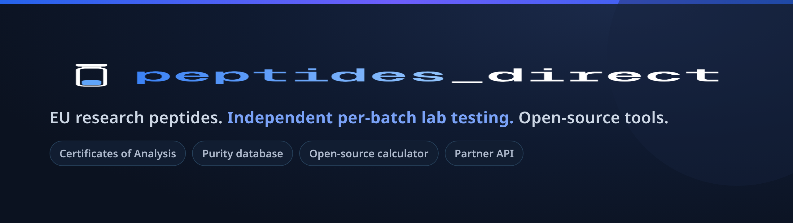

## PeptidesDirect

EU research-peptide supplier with independent, third-party per-batch lab testing (Certificates of Analysis) and open, cited reference tools for the research community.

- Shop: https://peptidesdirect.io
- Independent lab reports (CoAs): https://peptidesdirect.io/coa
- Peptide purity database: https://peptidesdirect.io/purity
- Research hub, dosing reference and study library: https://peptidesdirect.io/research
- GLP-1 / GIP clinical-trial tracker: https://peptidesdirect.io/research/glp-1-trials
- Research blog and guides: https://peptidesdirect.io/blog
- Open-source reconstitution calculator: https://github.com/peptidesdirect-io/peptide-reconstitution-calculator (live demo: https://calc.peptidesdirect.io)

We build free, embeddable, source-cited tools for peptide research. All products are sold for laboratory and research use only.
